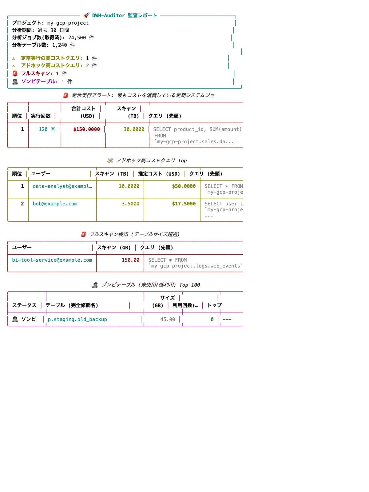

#################################################################
dwh-auditor — DWH コスト監査 & ガバナンスツール
#################################################################

.. image:: https://img.shields.io/badge/python-3.9%20%7C%203.10%20%7C%203.11%20%7C%203.12-blue
   :alt: Python Versions

.. image:: https://img.shields.io/badge/license-MIT-green
   :alt: License MIT

.. image:: https://img.shields.io/badge/pypi-v0.2.5-blue
   :alt: PyPI version

|

**dwh-auditor** は、BigQuery の `INFORMATION_SCHEMA` を解析し、
クラウドデータウェアハウスの **コスト最適化・セキュリティ監査・ガバナンス強化** を
コマンド一発で実現するオープンソース CLI ツールです。

.. tip::

   **実際のテーブルデータには一切アクセスしません。**
   メタデータ（``INFORMATION_SCHEMA``）のみを読み取るため、
   セキュリティポリシーが厳しいエンタープライズ環境でも即座に導入できます。

主な機能
========

.. list-table::
   :widths: 5 30 65
   :header-rows: 1

   * - #
     - 機能
     - 説明
   * - 💸
     - **アドホック高コストクエリ検知**
     - 過去 N 日間で単発の課金バイト数が多かったクエリを Top-N でランキング表示します。
   * - 🔄
     - **定常実行アラート (定期的な高コストクエリ)**
     - バッチやダッシュボード等から定期的に実行され、積算コストが高額になっているクエリを検知します。
   * - 🚨
     - **フルスキャン検知**
     - ``WHERE`` 句のパーティション指定漏れなど、非効率なフルスキャンクエリを警告します。
   * - 🧟
     - **ゾンビテーブル検知**
     - 長期間参照されていないテーブルを特定し、不要なストレージコストを可視化します。
   * - 📊
     - **マルチフォーマット出力 (Markdown / JSON)**
     - CI/CD に組み込み、GitHub Actions の Artifact に保存したり jq でパース可能な結果を出力します。

クイックスタート
================

.. code-block:: bash

   pip install dwh-auditor

   # Generate a configuration file
   dwh-auditor init

   # Audit BigQuery project (Console output)
   dwh-auditor analyze --project my-gcp-project --days 30

   # Generate Markdown report
   dwh-auditor analyze --project my-gcp-project --output markdown

ドキュメント目次
================

.. toctree::
   :maxdepth: 2
   :caption: はじめに

   quickstart
   configuration

.. toctree::
   :maxdepth: 2
   :caption: 設計・アーキテクチャ

   architecture

.. toctree::
   :maxdepth: 2
   :caption: API リファレンス

   api/index

.. toctree::
   :maxdepth: 1
   :caption: 運用・デプロイ

   contributing

必要な IAM 権限
================

dwh-auditor はメタデータのみを読み取るため、必要な権限は最小限です。

.. list-table::
   :header-rows: 1
   :widths: 40 60

   * - IAM ロール
     - 用途
   * - ``roles/bigquery.metadataViewer``
     - データセット・テーブルのメタデータ閲覧
   * - ``roles/bigquery.resourceViewer``
     - ジョブ履歴 (``INFORMATION_SCHEMA.JOBS``) の閲覧

.. warning::

   ``roles/bigquery.dataViewer`` 以上の権限は **不要** です。
   テーブルの実データ（レコードの中身）にはアクセスしません。

インデックス・検索
==================

* :ref:`genindex`
* :ref:`modindex`
* :ref:`search`
